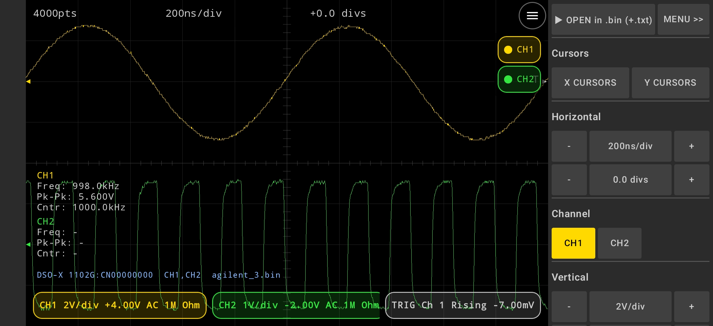
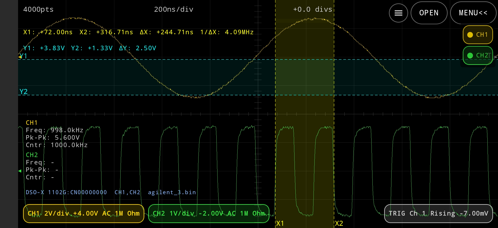

# android-oscilloscope-binary-file-viewer
Third-party Android UI for Agilent (KeySight) oscilloscope binary file viewer
> **Note:** This project is distributed as the **WaveScope edition of EC FusionKit**.

## 📥 Download

Last updated: 2026-07-12

[Download 
EC-FusionKit-v1.13.5.apk](https://github.com/EmbeddedChan/android-oscilloscope-binary-file-viewer/raw/main/apk/EC-FusionKit-v1.13.5.apk)

```text
EC FusionKit
│
│
├── WaveScope(Agilent/KeySight)
│
├── Terminals
│   ├── USB Serial Terminal
│   ├── BLE Serial Terminal
│   ├── FTDI Serial Terminal(Dedicated to FTDI USB serial devices)
│   └── SCPI Terminal
│
├── Network
│   ├── UDP
│   ├── TCP Client
│   └── TCP Server
│
└── Utilities
     ├── HEX/BIN/DEC
     ├── FHex Editor
     ├── Calculator
     └── Text File Compare
```

## 🖼 UI Preview





EC-FusionKit is available in two editions:

### Free Version
Includes all standard features, except Pro-exclusive functions.

### Pro Version
Unlocks advanced features, including:
- >100000 pts